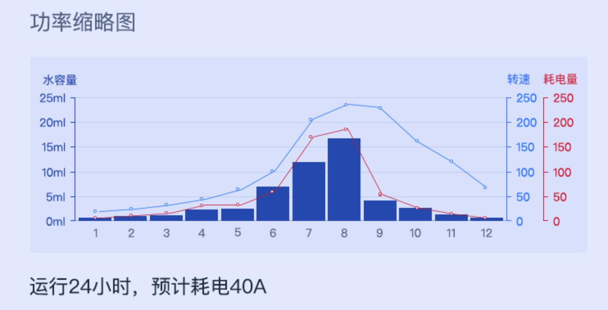
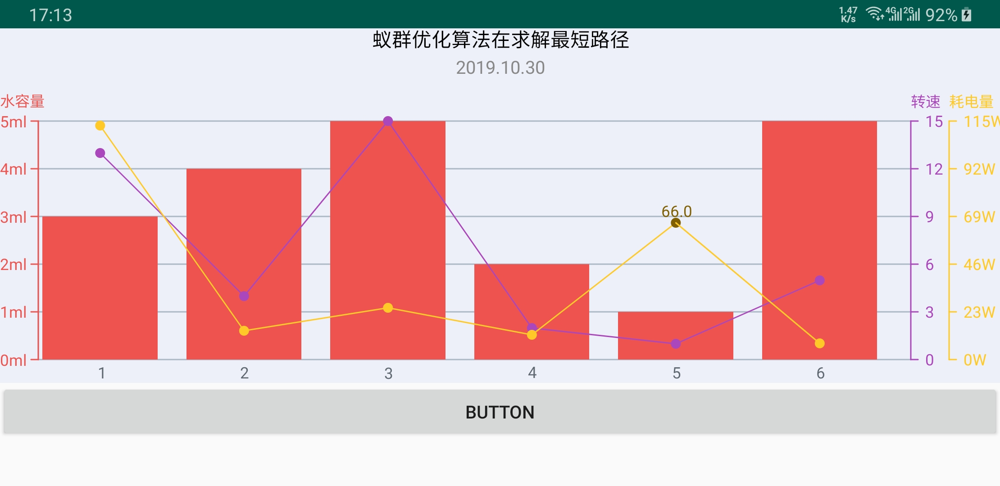

### 原始效果图

### Demo效果图

<video id="video" controls="" preload="none" poster="img/1.jpg">
      <source id="mp4" src="img/2.mp4" type="video/mp4">
	  </video>

### OneChart的由来
- 组内学习自定义View的基础Demo

